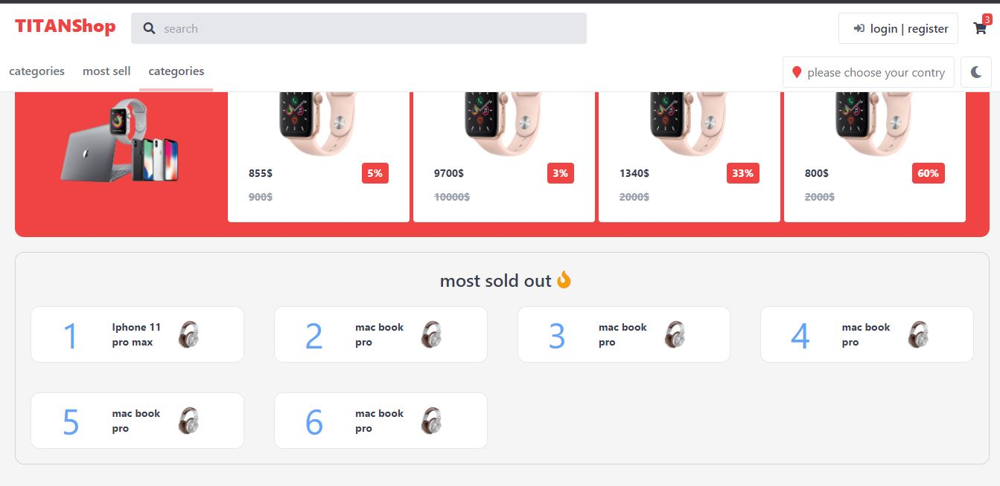
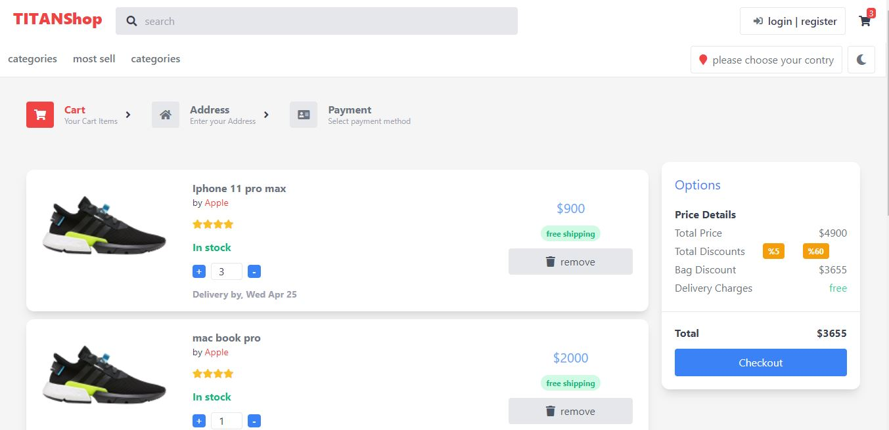
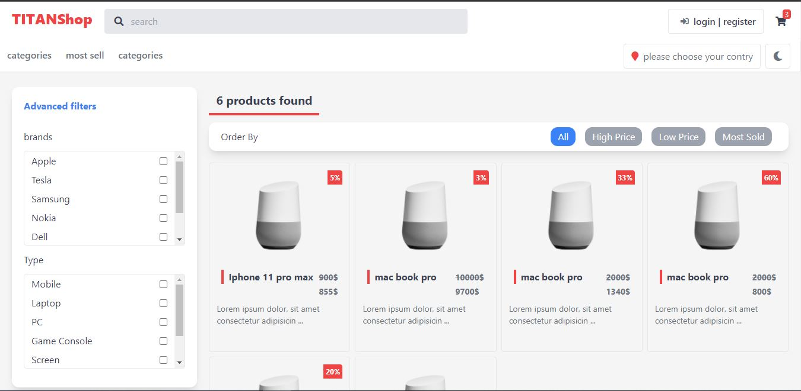
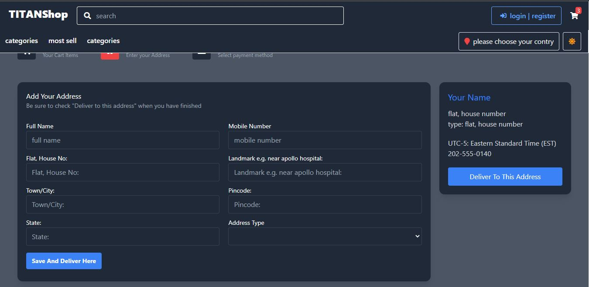

# ecommerce_project
 this is an advanced ecommerce project created with vue js and tailwind css.
 
## run project 
	npm install
	npm run serve
 
## Pages
1. home page 
2. product page
3. all products page with filters
4. login and register pages
5. shopping cart
6. topic page
	
## This project is using
- vue js version 3.0.0
- vuex version 4.0.0-0
- vue-router version 4.0.0-0
- tailwind css version 2.2.17
- swiper version 6.7.5 
	
## Images

	
	
	
	
	

